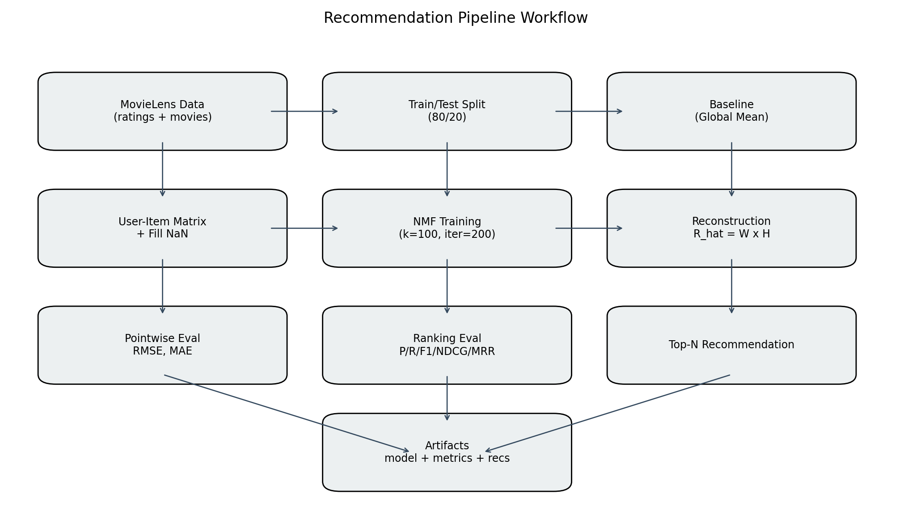
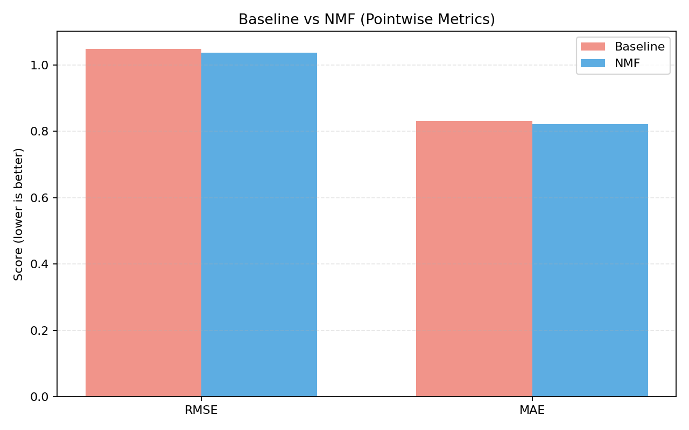
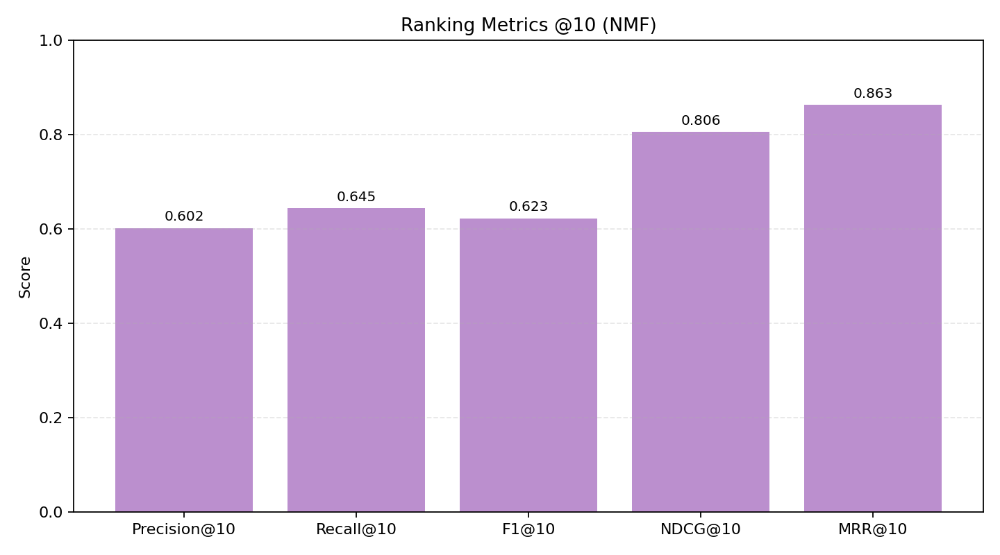
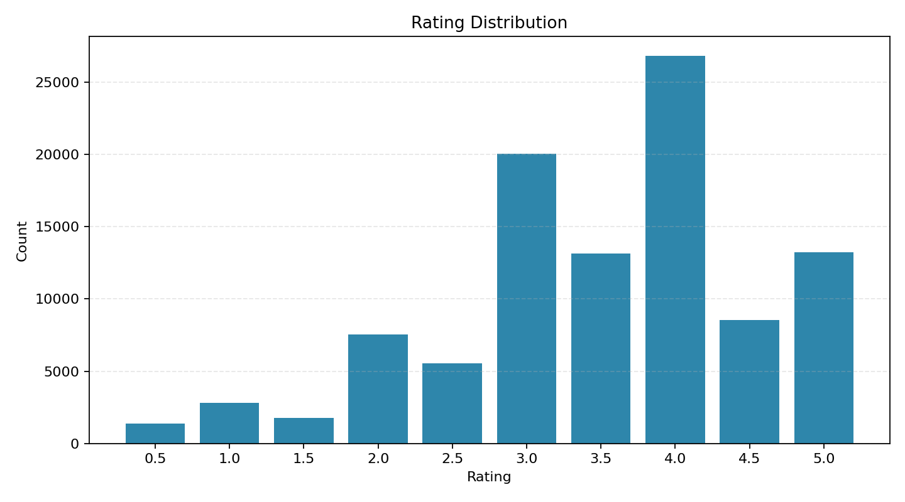
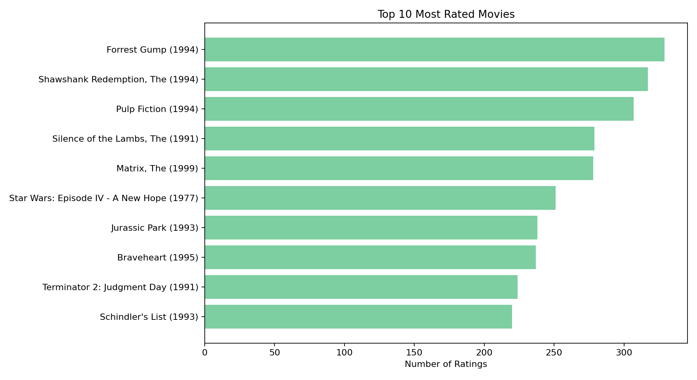

# Movie Recommendation System
## AIL303m - Machine Learning Minicapstone

This repository is structured as a clean submission version with reproducible pipeline, report assets, and presentation slides.

## Team Members
* **Hải**: Data Exploratory & Visualization
* **Minh**: Data Preprocessing & Validation 
* **Đức**: Baseline Setup & Evaluation Metrics
* **Chung**: Matrix Factorization Modeling (NMF)
* **Dương**: Report Writing & Pipeline Integration

## 1. Motivation
Streaming platforms face **information overload**: users struggle to pick relevant movies from very large catalogs.
This project builds a recommendation workflow to improve personalization quality with measurable metrics.

## 2. Problem Statement
- Input: historical explicit ratings `(userId, movieId, rating)`.
- Output:
  - Predicted ratings for unseen user-item pairs.
  - Top-N personalized movie recommendations.
- Goal: outperform baseline using pointwise + ranking metrics.

## 3. Dataset
Source: MovieLens `ml-latest-small` (`data/ml-latest-small/`)
- Ratings: **100,836**
- Users: **610**
- Movies: **9,742**
- Rating scale: **0.5 - 5.0**
- Sparsity: **~98.3%**

## 4. Method
- Baseline: global mean/popularity-style reference.
- Main implemented model: **NMF** (`sklearn.decomposition.NMF`) in `pipeline.py`.
- SVD: retained as theoretical collaborative-filtering framing in oral/report explanation.

## 5. Pipeline (Visual)


For detailed step-by-step I/O and controls, see: [`pipeline.md`](pipeline.md).

## 6. Experimental Results
Source of truth: `reports/pipeline_metrics.json`

### 6.1 Pointwise Metrics (Baseline vs NMF)
- Baseline RMSE/MAE: **1.0488 / 0.8316**
- NMF RMSE/MAE: **1.0365 / 0.8212**
- Improvement: **+1.18% RMSE**, **+1.25% MAE**



### 6.2 Ranking Metrics @10 (NMF)
- Precision@10: **0.6023**
- Recall@10: **0.6447**
- F1@10: **0.6228**
- NDCG@10: **0.8056**
- MRR@10: **0.8628**



## 7. Data Visual Highlights
### 7.1 Rating Distribution


### 7.2 Top 10 Most Rated Movies


> These visuals are generated from the same dataset and metric artifacts used by the pipeline.

## 8. Interpretation (Why gains are moderate)
- Baseline on explicit ratings is already relatively strong.
- Matrix is highly sparse (~98.3%).
- Limited content/context features (e.g., cast/director/text) in current scope.

## 9. Repository Structure
```text
project/
├── assets/
│   ├── course_detail.txt
│   └── figures/                         # README/report visuals
├── data/ml-latest-small/
├── notebooks/
├── models/
├── reports/
│   ├── project_report.docx              # Main submission report (Word)
│   ├── project-introduction.pptx        # Slide deck 1
│   ├── minicapstone.pptx                # Slide deck 2
│   └── pipeline_metrics.json            # Metric source of truth
├── pipeline.py
├── pipeline.md
├── project.json
├── requirements.txt
└── README.md
```

## 10. Reproducibility
### Install
```bash
pip install -r requirements.txt
```

### Run pipeline
```bash
python3 pipeline.py
```

Pipeline artifacts:
- `models/nmf_pipeline.pkl`
- `reports/pipeline_metrics.json`

Optional internal demo output (only when requested):
```bash
python3 pipeline.py --recommend-user 42 --recommendations-out /tmp/top_recommendations.csv
```

## 11. Submission Documents
- Main Word report: `reports/project_report.docx`
- Pipeline explanation: `pipeline.md`
- Slides:
  - `reports/project-introduction.pptx`
  - `reports/minicapstone.pptx`

## 12. Notes for Evaluation
- Claims are tied to measurable metrics.
- Baseline comparison is explicit.
- Limitations and fallback directions are documented.
