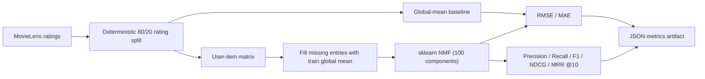
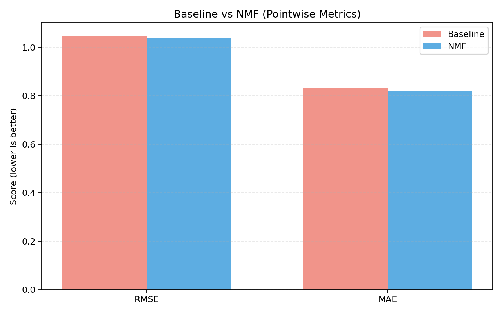

# MovieLens Recommendation Study — NMF Collaborative Filtering

> **AIL303m team project at FPT University.** The repository name
> `SVD-ail303m-g5project` is retained for course traceability, but the
> implementation in this repository is **Non-negative Matrix Factorization
> (NMF)**, not SVD.

The project compares a global-mean baseline with an NMF collaborative-filtering
pipeline on MovieLens `ml-latest-small`, then evaluates both pointwise error and
ranking behavior on a deterministic hold-out split.

## Team attribution

| Member | Documented role |
|---|---|
| Hải | Exploratory data analysis, visualization, report writing |
| Minh | Data preprocessing, validation |
| Đức | Baseline setup, evaluation metrics |
| Chung | NMF matrix-factorization modeling |
| Dương | Pipeline integration |

The metrics and final system are team outputs. Phạm Hoàng Hải's documented work
does not imply individual ownership of the NMF model or the team's reported
results.

## Pipeline


```mermaid
flowchart LR
    A["MovieLens ratings"] --> B["Deterministic 80/20 rating split"]
    B --> C["Global-mean baseline"]
    B --> D["User-item matrix"]
    D --> E["Fill missing entries with train global mean"]
    E --> F["sklearn NMF (100 components)"]
    C --> G["RMSE / MAE"]
    F --> G
    F --> H["Precision / Recall / F1 / NDCG / MRR @10"]
    G --> I["JSON metrics artifact"]
    H --> I
```

Implementation: [`pipeline.py`](pipeline.py). Detailed I/O and controls:
[`pipeline.md`](pipeline.md).

## Dataset and terms

The tracked dataset is GroupLens MovieLens `ml-latest-small`:

- 100,836 ratings from 610 anonymized users;
- 9,742 movies;
- explicit ratings from 0.5 to 5.0;
- development dataset generated in 2018.

MovieLens retains its own research-use, attribution, redistribution and
non-commercial conditions. Read the bundled
[`data/ml-latest-small/README.txt`](data/ml-latest-small/README.txt) before
reusing the data or results. This repository does not imply endorsement by the
University of Minnesota or GroupLens.

## Reproduced results

Tracked reference artifact:
[`notebooks/pipeline_metrics.json`](notebooks/pipeline_metrics.json).

| Metric | Global mean | NMF |
|---|---:|---:|
| RMSE | 1.0488 | 1.0365 |
| MAE | 0.8316 | 0.8212 |

| NMF ranking metric | Value |
|---|---:|
| Precision@10 | 0.6023 |
| Recall@10 | 0.6447 |
| F1@10 | 0.6228 |
| NDCG@10 | 0.8056 |
| MRR@10 | 0.8628 |

The July 2026 reproduction matched dataset counts, parameters and all headline
values. Raw floating-point values differed by at most `8.1e-12` under NumPy
2.5.1, pandas 3.0.5 and scikit-learn 1.9.0, which is expected numerical drift
and does not change the reported precision.



## Reproduce

Python 3.12:

```bash
python3.12 -m venv .venv
source .venv/bin/activate
python -m pip install --upgrade pip
python -m pip install -r requirements.txt
python pipeline.py
```

The command writes:

- `models/nmf_pipeline.pkl` — ignored local model artifact;
- `reports/pipeline_metrics.json` — regenerated metrics.

Compare a regenerated file with the tracked reference while ignoring only
`generated_at_utc` and allowing `1e-10` absolute tolerance for floating-point
metrics.

Optional recommendation output:

```bash
python pipeline.py \
  --recommend-user 42 \
  --recommendations-out /tmp/top_recommendations.csv
```

## Evaluation limits

- The 80/20 split is random over rating rows, not temporal and not grouped by
  user; it does not measure cold-start performance.
- Ranking metrics are computed over each user's held-out rated items, not a
  full-catalog candidate set with sampled negatives. They should not be read as
  online recommendation quality.
- Relevance is defined as rating `>= 3.5`; changing this threshold or `k`
  changes the ranking metrics.
- Missing train-matrix entries are filled with the global mean before NMF,
  which creates a dense objective and is not the same as optimizing only
  observed interactions.
- The pointwise improvement over the global-mean baseline is modest
  (approximately 1.18% RMSE and 1.25% MAE).
- No temporal, fairness, diversity, novelty, coverage, or online A/B evaluation
  is included.

## Repository map

```text
.
├── assets/figures/                 # README/report figures
├── data/ml-latest-small/           # MovieLens data + upstream terms
├── notebooks/                      # EDA, baseline, NMF, reference metrics
├── reports/                        # DOCX/PPTX course deliverables
├── pipeline.py                     # deterministic training/evaluation entrypoint
├── pipeline.md                     # pipeline contract and controls
├── project.json                    # project summary
└── requirements.txt
```

Course deliverables:

- [`reports/project_report.docx`](reports/project_report.docx)
- [`reports/project-introduction.pptx`](reports/project-introduction.pptx)
- [`reports/presentation.pptx`](reports/presentation.pptx)
